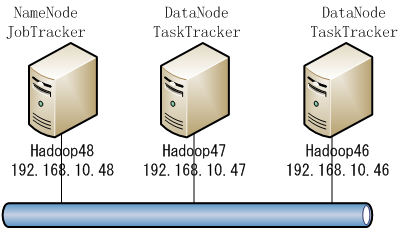

# hadoop汇总  
## hadoop结构  

topo节点：  
  192.168.10.46 Hadoop46  
  192.168.10.47 Hadoop47  
  192.168.10.48 Hadoop48  
Hadoop的守护进程deamons：
NameNode/DataNode 和 JobTracker/TaskTracker。其中NameNode/DataNode工作在HDFS层，JobTracker/TaskTracker工作在MapReduce层。
设备列表中Hadoop48是master，担任namenode和jobtracker，46，47为slave，担任datanode和tasktracker。secondary namenode在hadoop 1.03中被废弃，用checkpoint node或backupnode来代替。暂没有配checkpoint node或backupnode。

Hadoop集群的详细搭建过程请参考[hadoop docs](http://hadoop.apache.org/docs/r1.0.4/cn/index.html)

hadoop项目的基本模块：
- Hadoop Common: 支持Hadoop其他模块的工具集合.
- Hadoop Distributed File System (HDFS™): 一个分布式文件系统,提供高吞吐量访问应用程序数据的分布式文件系统
- Hadoop YARN: 是一个工作任务调度和集群资源管理的框架
- Hadoop MapReduce: 基于YARN框架并发处理大数据集合的系统

hadoop节点之间的通信是通过RPC方式进行的，同一节点之间是通过IPC方式通信的。详见[《Hadoop 2.0的两种RPC》](http://developer.51cto.com/art/201305/395820.htm)
